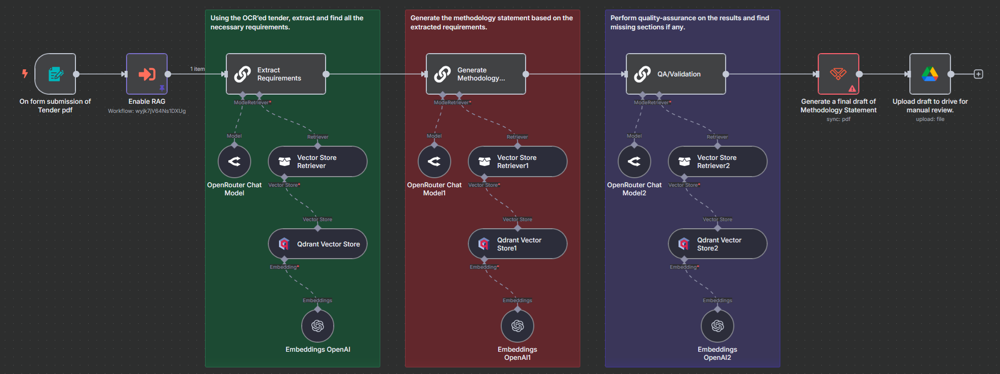

# AIPOTEGEN (AI-Powered Tender and Methodology Generator)

This repository contains the proof-of-concept n8n workflow and related assets for automating tender and methodology statement preparation using AI. 

---

## Workflow Images Gallery

Below is a gallery showcasing key screenshots of the n8n workflow nodes and flow diagrams.

### Main Automation Overview

### RAG (Retrieval-Augmented Generation) System and OCR System

---

## Setup Instructions

To get this workflow running locally using Docker, please follow these steps:

1. **Rename the environment file**

   In the n8n-qdrant-docker folder of this repository, there is a file named `.env-sample`.  
   Rename this file to `.env`:

2. **Run docker instance**

   Run a docker instance using `docker compose up` or `docker compose up -d` to run in daemon mode.
   qdrant will run in host-mode and is accessible by using `http://qdrant:6333`

## Additional Documentation

Further detailed documentation, including the full project proposal, workflow rationale, and technical specifications, can be found in [PROPOSAL FOR AI-POWERED TENDER & METHODOLOGY AUTOMATION](https://docs.google.com/document/d/1Uo3z40s9Fwa3-ZL5joFZn8GUObPLXep3yIBW8A-d6qs)

## Notes

- Ensure your API keys have sufficient quota for usage.
- Your `.env` file contains sensitive information; do **not** commit or add it to public repositories.

---

## License

This proof-of-concept is licensed under the MIT License.
